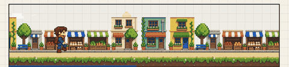
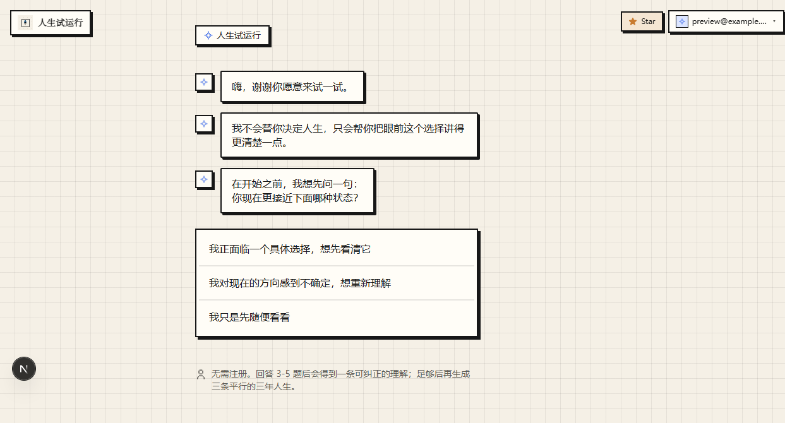
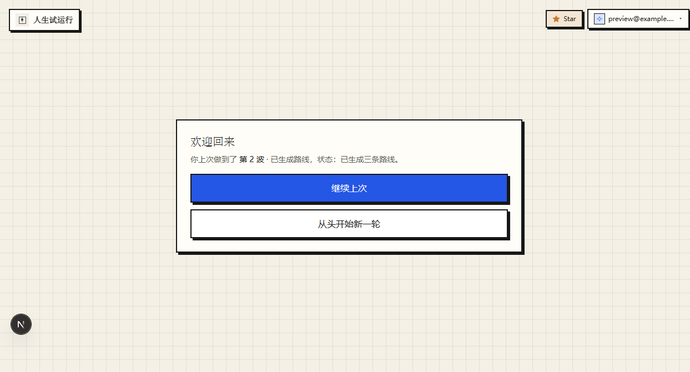
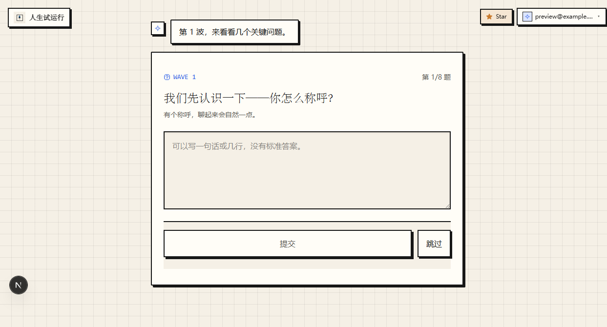
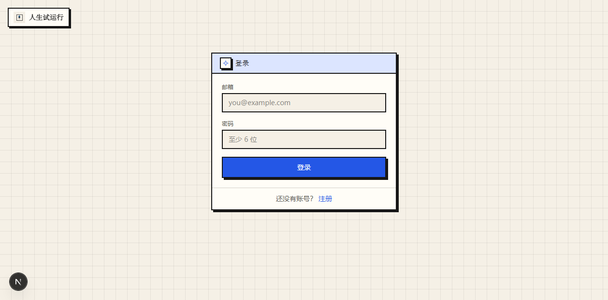
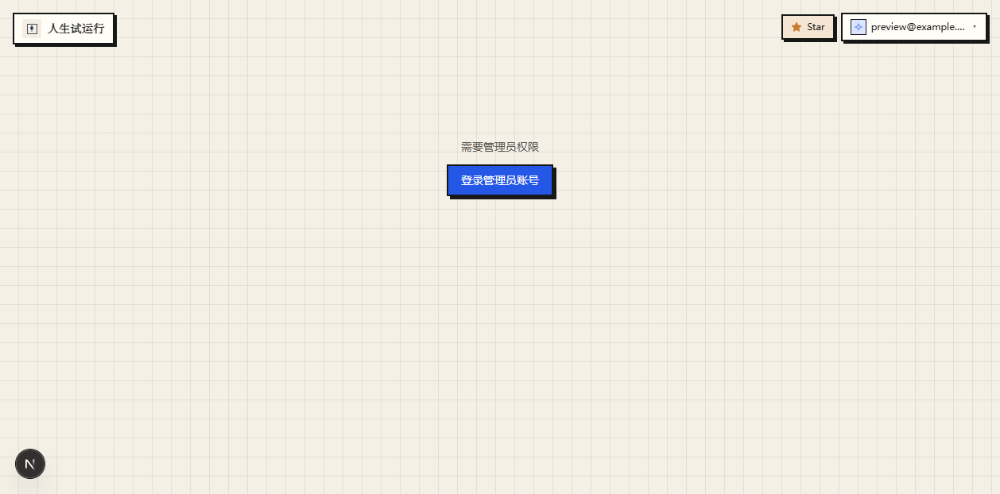
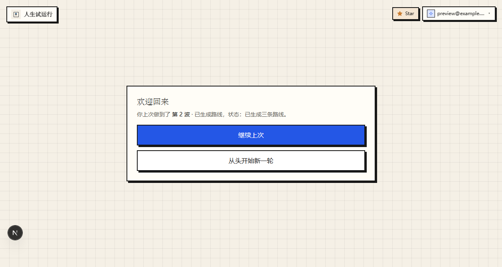

<div align="center">


# 人生试运行 · Lifetide Lite

**通过几轮短问答，看见三种未来，并试玩其中三天。**

*See three possible futures through a few rounds of short conversations, then try one for three days.*

[](https://github.com/Haaaiawd/lifetide-lite)
[](#一键部署)
[](https://nextjs.org)
[](https://www.typescriptlang.org)
[](https://www.prisma.io)
[](LICENSE)

[English](#-english) · [中文](#-中文)

</div>

---

## 🌏 中文

### 这是什么

**人生试运行**是一个对话式人生设计工具。它不是心理测评，也不是决策树——它是一个让你在不确定中看见更多可能性的空间。

你回答几轮短问题，AI 理解你并生成个人画像，然后为你展开三条地位平等的三年平行人生。你选一条，试玩三天，再决定要不要继续。

### 核心体验

<div align="center">

**16-bit 像素小人陪你走过一天** — 天空从黎明到夜晚，街道无限滚动



</div>

<table>
<tr>
<td width="50%" align="center">
<b>首页</b><br/>

</td>
<td width="50%" align="center">
<b>三条平行人生</b><br/>

</td>
</tr>
<tr>
<td width="50%" align="center">
<b>对话式访谈</b><br/>

</td>
<td width="50%" align="center">
<b>登录 / 注册</b><br/>

</td>
</tr>
<tr>
<td width="50%" align="center">
<b>管理员后台</b><br/>

</td>
<td width="50%" align="center">
<b>路线详情</b><br/>

</td>
</tr>
</table>

### 设计原则

| 原则 | 说明 |
|------|------|
| 🌊 **短波次** | 每轮只问 3-5 题，答完立刻给出带依据的理解，你可以纠正 |
| ⚖️ **地位平等** | 三条路线没有排名，它们是同一个你的不同展开 |
| 🔄 **可逆** | 选一条不是为了决定终身，而是先试玩三天 |
| 🔒 **隐私优先** | 数据在你自己的数据库里，不上传第三方 |
| 📎 **证据可追溯** | 每条路线的判断都链接回你说过的话 |

### 双 Agent 架构

- **Interviewer** 🎤 — 负责提问，根据你的回答和反馈动态调整下一轮方向
- **Sensemaker** 🧠 — 负责理解，每轮结束给出带证据的 insight，并记录不确定性

### 一键部署

```bash
git clone https://github.com/Haaaiawd/lifetide-lite.git
cd lifetide-lite
cp .env.example .env  # 填入 AIPING_API_KEY 和 JWT_SECRET
docker compose up -d --build
```

创建管理员账号：

```bash
docker compose cp scripts/seed-admin.cjs lifetide:/app/seed-admin.cjs
docker compose exec lifetide node /app/seed-admin.cjs
```

访问 `http://localhost:3000` 即可。

### 云服务器部署

#### 1. 准备服务器

```bash
# 安装 Docker
curl -fsSL https://get.docker.com | sh
sudo usermod -aG docker $USER
```

#### 2. 拉取代码并配置

```bash
git clone https://github.com/Haaaiawd/lifetide-lite.git
cd lifetide-lite
cp .env.example .env
```

编辑 `.env`，**必须修改**：

```env
JWT_SECRET="用 openssl rand -hex 32 生成"
AIPING_API_KEY="你的 API Key"
ADMIN_EMAIL="your-admin@example.com"
NEXT_PUBLIC_ADMIN_EMAIL="your-admin@example.com"
NEXT_PUBLIC_GITHUB_URL="https://github.com/Haaaiawd/lifetide-lite"
```

#### 3. 构建启动

```bash
docker compose up -d --build
```

#### 4. 创建管理员

```bash
docker compose cp scripts/seed-admin.cjs lifetide:/app/seed-admin.cjs
docker compose exec lifetide node /app/seed-admin.cjs
```

#### 5. 配置 Nginx + HTTPS

```nginx
server {
    listen 80;
    server_name your-domain.com;
    client_max_body_size 10M;

    location / {
        proxy_pass http://localhost:3000;
        proxy_set_header Host $host;
        proxy_set_header X-Real-IP $remote_addr;
        proxy_set_header X-Forwarded-For $proxy_add_x_forwarded_for;
        proxy_set_header X-Forwarded-Proto $scheme;
        proxy_http_version 1.1;
        proxy_set_header Upgrade $http_upgrade;
        proxy_set_header Connection "upgrade";
    }
}
```

```bash
sudo ln -s /etc/nginx/sites-available/lifetide /etc/nginx/sites-enabled/
sudo nginx -t && sudo systemctl reload nginx
sudo certbot --nginx -d your-domain.com
```

#### 6. 验证

```bash
curl https://your-domain.com/api/progress  # 返回 JSON 即正常
```

#### 升级 & 备份

```bash
# 升级
git pull && docker compose up -d --build

# 备份
docker compose exec lifetide cat /app/data/lifetide.db > backup-$(date +%Y%m%d).db

# 恢复
docker compose cp backup.db lifetide:/app/data/lifetide.db
docker compose restart lifetide
```

> 更详细的说明见 [docs/DEPLOYMENT.md](docs/DEPLOYMENT.md)

### 本地开发

```bash
pnpm install
cp .env.example .env  # 编辑 .env
pnpm db:generate && npx prisma db push
pnpm dev  # http://localhost:3000
```

### 环境变量

| 变量 | 必填 | 说明 |
|------|:----:|------|
| `DATABASE_URL` | ✅ | SQLite 路径，如 `file:./prisma/dev.db` |
| `JWT_SECRET` | ✅ | JWT 签名密钥，生产环境务必修改 |
| `ADMIN_EMAIL` | ✅ | 管理员邮箱 |
| `AI_PROVIDER` | ✅ | AI 提供商，目前支持 `aiping` |
| `AIPING_API_KEY` | ✅ | Aiping API Key |
| `AIPING_BASE_URL` | ❌ | 默认 `https://aiping.cn/api/v1` |
| `AIPING_MODEL` | ❌ | 默认 `Qwen3.7-Plus` |
| `MULTIMODAL_MODEL` | ❌ | 默认 `Qwen3.5-Flash` |
| `NEXT_PUBLIC_GITHUB_URL` | ❌ | GitHub 仓库地址，用于 Star 按钮 |

### 技术栈

| 层 | 技术 |
|----|------|
| 框架 | Next.js 16 (App Router) |
| 语言 | TypeScript 5.8 |
| 样式 | Tailwind CSS v4 |
| 动画 | Motion (`motion/react`) |
| 图标 | Phosphor Icons + Pixelart Icons |
| 数据库 | Prisma + SQLite |
| 认证 | JWT (`jose`) + bcrypt |
| AI | Aiping (OpenAI-compatible) |
| 测试 | Vitest + Playwright |

### 视觉方向

**Soft Editorial Neo-Brutalism** — off-white 方格纸底、ink 墨色、cobalt 强调色、2px 边框、硬偏移阴影、克制的圆角。关键陈述用编辑感中文衬线体，UI 用清晰无衬线体。

### 项目结构

```
app/              Next.js App Router
  api/            API 路由（auth, wave, portrait, final, admin）
  play/           核心产品页面（访谈 → 画像 → 路线 → 试玩）
  admin/          管理员后台
  account/        个人中心
  login/          登录/注册
components/       React 组件
  routes/         路线相关（RouteCarousel, ScenePlayer, DayProgressAnimation）
  portrait/       画像卡片
  play/           访谈对话组件
  art/            像素艺术装饰
lib/              核心逻辑
  ai/             AI provider + Interviewer/Sensemaker
  auth/           认证、session、邀请码
  working-memory/ 工作记忆（答案、证据、不确定性、路线意图）
  prisma/         数据库 schema 和 client
  privacy/        Consent 管理
  state/          XState 状态机 + 事件提交
public/           静态资源（logo, sprites, portraits）
prisma/           Prisma schema
tests/            契约测试 + 单元测试
```

### 开发命令

```bash
pnpm dev              # 开发服务器
pnpm build            # 生产构建
pnpm typecheck        # 类型检查
pnpm test:contracts   # 契约 + 单元测试
pnpm test:e2e         # Playwright E2E
pnpm db:generate      # 生成 Prisma Client
```

---

## 🌐 English

### What is this?

**Lifetide Lite** (人生试运行, "Life Trial Run") is a conversational life-design tool. It's not a personality test or a decision tree — it's a space where you see more possibilities within your uncertainty.

You answer a few rounds of short questions. An AI understands you and generates a personal portrait. Then it unfolds three equally-weighted parallel lives spanning three years. You pick one, try it for three days, then decide whether to continue.

### Core Experience

<div align="center">

**16-bit pixel traveler walks you through a day** — sky shifts from dawn to night, street scrolls infinitely


</div>

<table>
<tr>
<td width="50%" align="center">
<b>Landing Page</b><br/>

</td>
<td width="50%" align="center">
<b>Three Parallel Lives</b><br/>

</td>
</tr>
<tr>
<td width="50%" align="center">
<b>Conversational Interview</b><br/>

</td>
<td width="50%" align="center">
<b>Login / Register</b><br/>

</td>
</tr>
</table>

### Design Principles

| Principle | Description |
|-----------|-------------|
| 🌊 **Short waves** | 3-5 questions per round, immediate evidence-based understanding you can correct |
| ⚖️ **Equal weight** | Three routes have no ranking — they're different unfoldings of the same you |
| 🔄 **Reversible** | Picking a route isn't a lifetime commitment — it's a 3-day trial |
| 🔒 **Privacy-first** | Data stays in your own database, never sent to third parties |
| 📎 **Traceable evidence** | Every route judgment links back to what you actually said |

### Quick Deploy

```bash
git clone https://github.com/Haaaiawd/lifetide-lite.git
cd lifetide-lite
cp .env.example .env  # Fill in AIPING_API_KEY and JWT_SECRET
docker compose up -d --build

# Create admin account
docker compose cp scripts/seed-admin.cjs lifetide:/app/seed-admin.cjs
docker compose exec lifetide node /app/seed-admin.cjs
```

Visit `http://localhost:3000`.

### Cloud Server Deployment

```bash
# 1. Install Docker on your server
curl -fsSL https://get.docker.com | sh

# 2. Clone & configure
git clone https://github.com/Haaaiawd/lifetide-lite.git
cd lifetide-lite
cp .env.example .env
# Edit .env: set JWT_SECRET, AIPING_API_KEY, ADMIN_EMAIL

# 3. Build & start
docker compose up -d --build

# 4. Create admin
docker compose cp scripts/seed-admin.cjs lifetide:/app/seed-admin.cjs
docker compose exec lifetide node /app/seed-admin.cjs

# 5. Configure Nginx reverse proxy + HTTPS
# See docs/DEPLOYMENT.md for full Nginx config
```

### Local Development

```bash
pnpm install
cp .env.example .env
pnpm db:generate && npx prisma db push
pnpm dev
```

### Tech Stack

| Layer | Technology |
|-------|-----------|
| Framework | Next.js 16 (App Router) |
| Language | TypeScript 5.8 |
| Styling | Tailwind CSS v4 |
| Animation | Motion (`motion/react`) |
| Database | Prisma + SQLite |
| Auth | JWT (`jose`) + bcrypt |
| AI | Aiping (OpenAI-compatible) |
| Testing | Vitest + Playwright |

### Admin Dashboard

Access `/admin` with the `ADMIN_EMAIL` account. Features:
- 📊 **Analytics** — user/session/portrait/route counts, wave distribution
- 🎟️ **Invite codes** — generate, view, delete, track usage
- 👥 **Users** — recent registrations
- 🗂️ **Sessions** — recent sessions with progress

---

<div align="center">

### ⭐ 如果这个项目对你有帮助，请给我们点 Star

[](https://github.com/Haaaiawd/lifetide-lite)

**[人生试运行 · Lifetide Lite](https://github.com/Haaaiawd/lifetide-lite)** · MIT License

</div>
